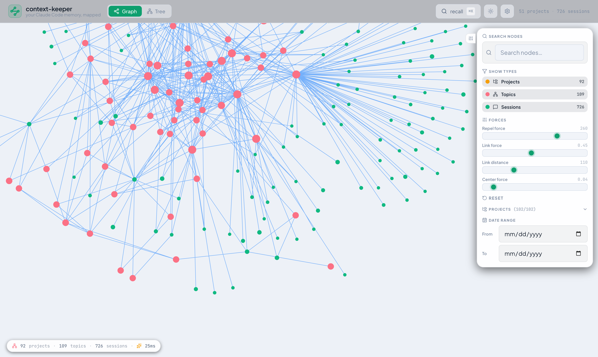
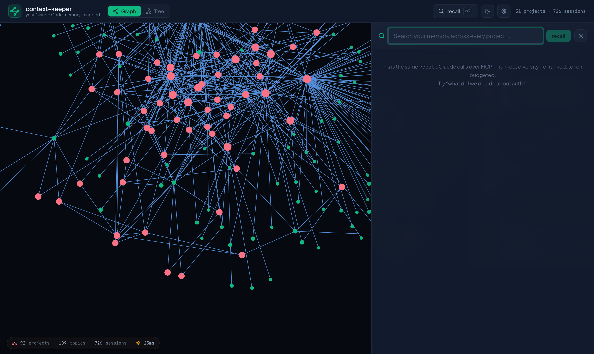
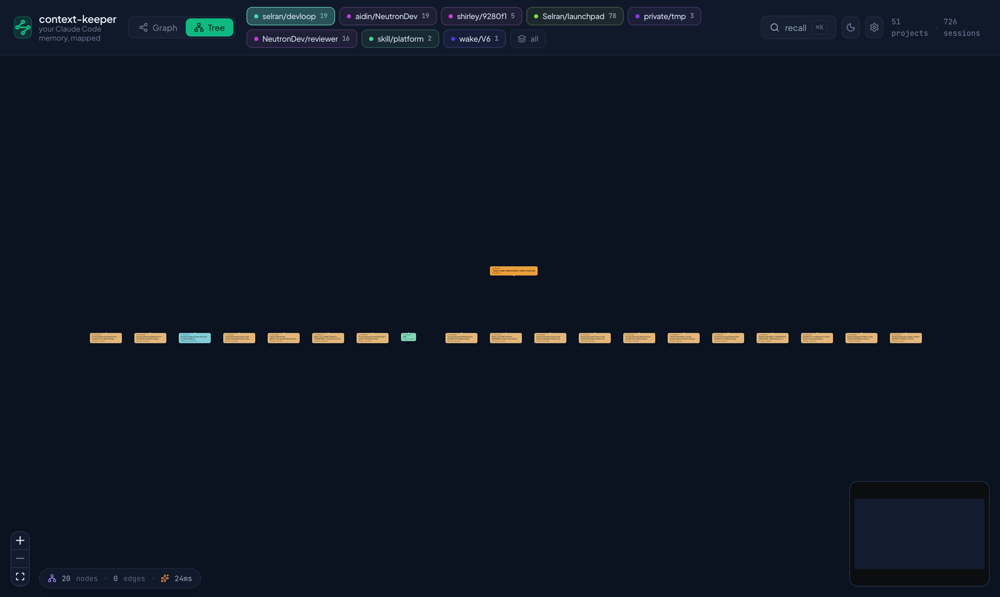

# context-keeper

Cross-session memory for [Claude Code](https://claude.com/claude-code) —
local-first, with a visual mind map of everything you've ever worked on.

By [Selran](https://selran.ai) — written and maintained by
**Padmalochan Singh** (padmalochan.singh@selran.ai), with **Aidin Eslampour**
(aidin.eslampour@selran.ai). MIT licensed.

Claude Code forgets everything between sessions. context-keeper walks every
transcript on disk, builds a semantic chunk index plus a topic graph, and
exposes a `recall(query)` MCP tool so future sessions pull exactly the past
context they need — ranked, diversity-re-ranked, token-budgeted. An optional
hook injects relevant memory into every prompt automatically, and a small
web UI renders your projects, topics, and sessions as an interactive map.

> Local-first: your transcripts are indexed on your machine by a local
> embedding model; the daemon binds `127.0.0.1` only; no telemetry. The only
> opt-in exception is LLM topic-naming/summaries — see [PRIVACY.md](PRIVACY.md).

## What it looks like

| Graph view (dark) | Graph view (light) |
|---|---|
|  |  |

| Recall — search your memory | Tree view |
|---|---|
|  |  |

## Use it from Claude Code (plugin)

```bash
# 1. The daemon (one-time; Rust toolchain required)
cargo install --git https://github.com/apourmd941/context-keeper ck
ck daemon &        # or: ./start.sh from a clone; or: ck autostart install

# 2. The plugin (ships the MCP wiring)
/plugin install context-keeper
```

Then ask Claude things like *"recall what we decided about the auth
refactor"* — or enable the auto-recall hook (§ Quickstart, step 8) and
relevant past context arrives with every prompt, no tool call needed.

**No database to install.** context-keeper stores everything in an
embedded SQLite file and a flat-file vector index under
`~/.context-keeper/` — there is no Postgres, no server, and no external
service to set up. The first run downloads a small local embedding model
(~130 MB); after that it works fully offline.

## What it does

```
~/.claude/projects/*.jsonl                   # source of truth (Claude Code's transcripts)
        │
        ▼
  [parse + chunk]   defensive JSONL → typed records → token-budgeted chunks
        │
        ▼
  [embed]           bge-small-en-v1.5 via fastembed (local ONNX, 384-d)
        │           ╲
        ▼            ▶ flat-file vector index (~/.context-keeper/index/vectors.bin)
  [cluster]         hand-rolled DBSCAN over chunk embeddings, per project
        │
        ▼
  [name + edge]     LLM topic names (orchestrator-routed, optional)
        │           topic-similarity, shared-file edges
        ▼
  [serve]           axum HTTP/WS on 127.0.0.1:7421 + React Flow mind map
        │           MCP stdio shim (recall, list_sessions, list_projects)
        ▼
  Claude Code session calls `recall("…")` and gets ranked, MMR-diversified,
  token-budgeted chunks back.
```

## Quickstart (macOS)

```bash
# One-time toolchain
brew install just pnpm rustup protobuf
rustup default stable

# Homebrew installs rustup keg-only — `cargo` won't be on your PATH yet.
# Add it (one of these, depending on your shell):
echo 'export PATH="/opt/homebrew/opt/rustup/bin:$PATH"' >> ~/.zshrc       # zsh (default)
echo 'export PATH="/opt/homebrew/opt/rustup/bin:$PATH"' >> ~/.bash_profile # bash
# Then open a new terminal, or `source` the file.

pnpm install

# Build
cargo build --release --bin ck

# 1. Walk transcripts (fast — metadata only)
./target/release/ck doctor

# 2. Embed every chunk (downloads BGE-small ~130MB on first run)
./target/release/ck doctor --with-embeddings

# 3. Cluster into topics + edges. LLM-names topics via the Selran
#    orchestrator (/v1/generate) when it's running; falls back to a direct
#    Anthropic call if ANTHROPIC_API_KEY is set, else centroid-text labels.
./target/release/ck cluster

# 4. Search
./target/release/ck search "the chunker design decisions"

# 5. Run the daemon + mind-map UI together (recommended).
#    Ports come from the shared Selran port registry (127.0.0.1:11999);
#    start.sh prints the assigned URLs. Stop with ./stop.sh (or Ctrl-C).
./start.sh

#    — or run them manually on the historical fixed ports —
# ./target/release/ck daemon &                 # daemon → 127.0.0.1:7421 (HTTP/WS + live re-index)
# curl http://127.0.0.1:7421/v1/health
# pnpm --filter ck-web dev                      # UI → http://localhost:5173 (proxies /v1 to the daemon)

# 7. Wire to Claude Code (MCP tool)
claude mcp add --scope user context-keeper -- $(pwd)/target/release/ck mcp
# from inside any Claude Code session, ask the agent to use the
# `recall`, `list_sessions`, or `list_projects` tools.

# 8. (Optional) Enable the auto-recall hook so every prompt gets
#    relevant past chunks injected as ambient context — no tool call
#    required. Add to ~/.claude/settings.json:
#
#    {
#      "hooks": {
#        "UserPromptSubmit": [
#          { "hooks": [
#              { "type": "command",
#                "command": "/ABSOLUTE/PATH/TO/scripts/auto-recall-hook.sh" } ] }
#        ]
#      }
#    }
#
#    Tunable via env vars: CK_HOOK_SCORE_THRESHOLD (0.60),
#    CK_HOOK_LIMIT (5), CK_HOOK_TOKEN_BUDGET (1500),
#    CK_HOOK_MIN_WORDS (4), CK_HOOK_SCOPE (project|global).
#    Silently no-ops when the daemon is down.
#    Full walkthrough: Instructions.md §7.
```

## Subcommands

| Command | What it does |
| --- | --- |
| `ck doctor [--dry-run] [--with-embeddings]` | Walk transcripts, persist sessions; with `--with-embeddings` also chunk + embed + index. |
| `ck cluster` | Run DBSCAN over the vector store; persist topics + edges. LLM-renames topics via the Selran orchestrator (`/v1/generate`) when running, else a direct Anthropic call when `ANTHROPIC_API_KEY` is set. |
| `ck search "<q>" [--project <id>] [--limit N]` | Local cosine search; prints ranked snippets + elapsed time. |
| `ck summarize [--session <id>] [--force] [--model <m>]` | Per-session structured summary. Routed through the orchestrator by default; direct Anthropic is a dev/offline fallback. Cached on `input_hash`. |
| `ck daemon [--bind 127.0.0.1:7421]` | Long-running indexer + HTTP/WS API. Watches `~/.claude/projects/` and re-indexes on change. Serves immediately; `/v1/health` reports `indexing` with progress during the boot scan. |
| `ck mcp` | JSON-RPC stdio shim; forwards tool calls to a running daemon. |
| `ck autostart install\|remove\|status` | Start-on-login via launchd (macOS). The agent runs `./start.sh`, so ports still come from the registry. |

## REST endpoints (`http://127.0.0.1:7421`, loopback-only)

```
GET  /v1/health
GET  /v1/projects
GET  /v1/sessions?project=&limit=
GET  /v1/sessions/:id
GET  /v1/sessions/:id/transcript
GET  /v1/graph?project=&include_sessions=
POST /v1/recall   {query, limit, project, token_budget, mmr_lambda}
GET  /v1/ws       (WebSocket — broadcasts session_indexed/daemon_ready events)
```

`recall` over-fetches 5× the limit (floor 50), runs MMR re-rank with
`lambda=mmr_lambda` (default 0.6), then greedily packs chunks under
`token_budget` (default 4000 tokens) using the per-chunk `tiktoken`
counts captured at chunking time. The response also carries a `stats`
block (candidate/returned counts, score range, timing); when auto-promote
is enabled it additionally kicks a background promotion check for
project-scoped, non-hook recalls.

## On-disk layout

```
~/.context-keeper/
  derived/                     # source of truth for derived data
    sessions/<sid>.json
    chunks/<sid>/<cid>.json
    topics/<tid>.json
    edges/<eid>.json
  index/
    meta.sqlite                # rebuildable
    vectors.bin                # rebuildable, bincode-serialized
  cache/
    embeddings/<model>/<sha>.bin
    llm-summaries/<sha>.json
    topic-names/<tid>.txt
    models/                    # downloaded ONNX
  state/
    schema-version
  sources/
    claude-projects -> ~/.claude/projects   # symlink, never copies
```

## Workspace layout

```
crates/
  ck-core         types, IDs, hashing
  ck-transcript   defensive JSONL parser; emits typed RecordViews
  ck-store        on-disk layout + SQLite metadata
  ck-chunk        token-budgeted chunker (1/user prompt, 400-tok windows)
  ck-embed        Embedder trait + LocalEmbedder (fastembed)
  ck-vector       flat-file linear-scan vector store + MMR
  ck-summarize    Summarizer trait: orchestrator-routed (default) + Anthropic (dev fallback)
  ck-graph        DBSCAN + edge scoring + LLM topic naming
  ck-pipeline     watcher + index orchestration; shared DaemonState
  ck-api          axum HTTP/WS routes
  ck-mcp          JSON-RPC stdio shim
  ck-daemon       run loop tying it all together
apps/
  ck              the binary (clap subcommands)
  web             Vite + React + TS + Tailwind + React Flow
```

## Notable design decisions

- **Hand-rolled DBSCAN** instead of `linfa-clustering` — `linfa 0.7` requires `ndarray 0.15` while `fastembed` pulls `ndarray 0.16`. Hand-rolled is microseconds at our scale and avoids the multi-version trait-impl conflict.
- **Flat-file vector store** instead of LanceDB — `lance 0.19.2`'s lib hits a rustc recursion-limit error on stable 1.95 that can only be fixed by patching lance itself. The flat-file store is faster than LanceDB at v0.1 corpus sizes; the `VectorStore` API is shaped so an ANN backend can be swapped in later.
- **Hand-rolled MCP** instead of `rmcp` — the stdio JSON-RPC protocol is small enough (~200 lines for the shim) that we control both ends and skip a churning third-party SDK.

## LLM features are optional

context-keeper's core — indexing, search, recall, and the UI — never needs a
network connection or an API key. The two LLM-assisted extras (per-session
summaries and topic naming) route through a local Selran orchestrator when one
is running (it holds the key and enforces an egress ceiling), or fall back to a
direct Anthropic call when you set `ANTHROPIC_API_KEY`. With neither, topics get
local centroid-text labels and no summaries are generated. See
[PRIVACY.md](PRIVACY.md).

## Known gaps (deferred to v0.2)

- Voyage cloud embeddings (the `Embedder` trait is in place; only `LocalEmbedder` ships).
- **Universal ingestion.** A pluggable `TranscriptSource` for Codex/ChatGPT histories is specced (`docs/UNIVERSAL_INGESTION.md`); only the Claude Code source ships today.

## Heads-up

- **`./start.sh` / `./stop.sh` are the recommended way to run both services.** Ports are assigned by the shared Selran port registry (`127.0.0.1:11999`), not hardcoded — `start.sh` prints the real URLs and writes `.app.pid` + `.daemon.log`/`.web.log` (git-ignored). The fixed `7421`/`5173` ports only apply when you run `ck daemon` / `pnpm --filter ck-web dev` bare.
- **Vite dev server binds IPv6 loopback (`::1`) only.** Browsers handle this transparently; from a script, curl `localhost:<port>` or `[::1]:<port>`, not `127.0.0.1:<port>`.
- **First daemon start downloads the BGE-small ONNX model (~130MB)** to `~/.context-keeper/cache/models/`. The download progress is logged via `tracing`.
- **Killing `ck daemon`**: `pkill -f "release/ck daemon"` is reliable. `kill $(pgrep -f "ck daemon")` often picks up the wrapper shell instead of the actual binary, leaving an orphan that holds port 7421.
